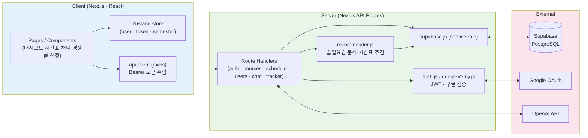
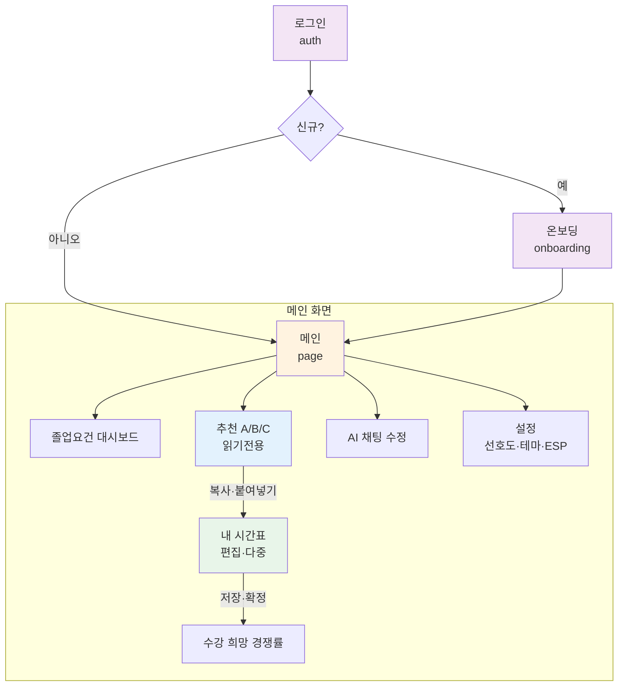
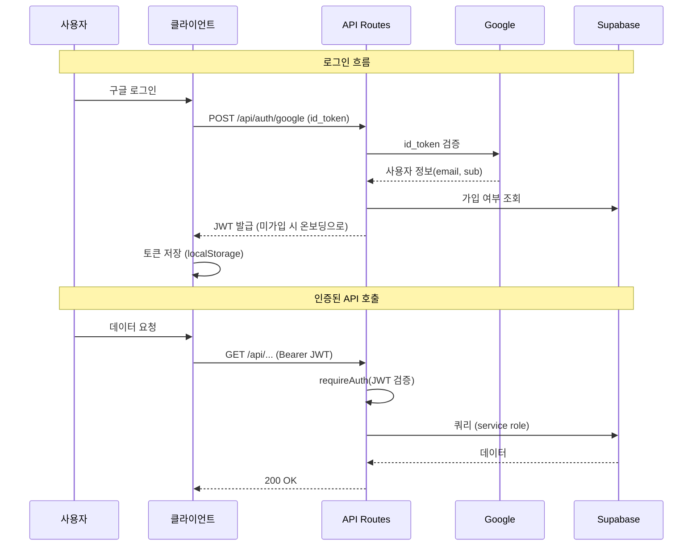

# KENTECHTIME

<div align="center">

### KENTECH 학생들을 위한 맞춤형 시간표 자동 추천 서비스

**"졸업 요건은 우리가 계산할게, 너는 듣고 싶은 것만 골라"**

[](https://nextjs.org/)
[](https://react.dev/)
[](https://supabase.com/)
[](https://platform.openai.com/)

[배포 바로가기](https://kentechtime.vercel.app)

</div>

---

## 목차

1. [프로젝트 소개](#프로젝트-소개)
2. [배포 링크 / 데모](#배포-링크--데모)
3. [팀 소개](#팀-소개)
4. [역할 분담](#역할-분담)
5. [브랜치 전략](#브랜치-전략)
6. [프로젝트 일정 / 진행 과정](#프로젝트-일정--진행-과정)
7. [기술 스택](#기술-스택)
8. [실행 방법](#실행-방법)
9. [프로젝트 구조](#프로젝트-구조)
10. [아키텍처 설계](#아키텍처-설계)
11. [사용자 시나리오](#사용자-시나리오)
12. [화면 설계 (화면 흐름)](#화면-설계-화면-흐름)
13. [주요 기능](#주요-기능)
14. [API / 인증 흐름](#api--인증-흐름)
15. [졸업 요건 로직](#졸업-요건-로직)
16. [모듈별 책임](#모듈별-책임)
17. [트러블슈팅 / 회고](#트러블슈팅--회고)

---

## 프로젝트 소개

> 매 학기 졸업 요건표와 시간표 사이트를 번갈아 보며 "이 과목 들으면 졸업 학점이 채워지나?" 고민하신 적 있으신가요?

**KENTECHTIME**은 KENTECH 학사과정 재학생을 위한 **졸업 요건 기반 맞춤형 시간표 자동 추천 서비스**입니다.
기수강 이력과 선호도를 입력하면, 남은 졸업 요건을 분석해 이번 학기에 들을 만한 시간표를 자동으로 만들어 줍니다.

| 문제 | 해결 |
|------|------|
| 복잡한 졸업 요건 계산 (영역별 학점·EF 세부영역·EL4·5·ESP 단계 등) | 기수강 이력 기반 **졸업 요건 대시보드**로 한눈에 시각화 |
| "뭘 들어야 졸업하지?" 고민 | 미이수 요건·선수 과목·선호도를 반영한 **시간표 Plan A/B/C 자동 추천** |
| 수기 시간표 조합의 번거로움 | 추천을 복사해 **내 시간표**에서 자유 편집, 충돌 시 클릭 한 번으로 교체 |
| 인기 과목 경쟁 예측 어려움 | 확정 시간표 기반 **수강 희망 경쟁률 트래커** (제한 인원 대비 경쟁률) |
| 자연어로 시간표 바꾸고 싶음 | "목요일 오전 수업 빼줘" 같은 **LLM 대화형 수정** |

---

## 배포 링크 / 데모

| 항목 | 링크 |
|------|------|
| 배포 URL | [kentechtime.vercel.app](https://kentechtime.vercel.app) |
| GitHub | [EFAI-Team10/KENTECHTIME](https://github.com/EFAI-Team10/KENTECHTIME) |

---

## 팀 소개

<div align="center">

### EFAI Team 10

</div>

<table align="center">
  <tr>
    <td align="center" width="200">
      <a href="https://github.com/Magnesium03">
        <br/>
        <b>팀장 강민기</b>
      </a><br/>
      <sub>Magnesium03</sub><br/>
      <sub>아이디어 제공 · 시간표 UI/UX · 내 시간표 · QA</sub>
    </td>
    <td align="center" width="200">
      <a href="https://github.com/Miniipad03">
        <br/>
        <b>권우성</b>
      </a><br/>
      <sub>Miniipad03</sub><br/>
      <sub>Next.js 마이그레이션 · 구글 인증 · AI 채팅 · 북마클릿</sub>
    </td>
    <td align="center" width="200">
      <a href="https://github.com/hdpark1105">
        <br/>
        <b>박현담</b>
      </a><br/>
      <sub>hdpark1105</sub><br/>
      <sub>졸업요건 대시보드 · 추천 알고리즘 · 다크모드/색상 테마</sub>
    </td>
    <td align="center" width="200">
      <a href="https://github.com/moviemania90">
        <br/>
        <b>구형준</b>
      </a><br/>
      <sub>moviemania90</sub><br/>
      <sub>디자인/스타일 통일 · 구조·로직 체계화 · QA</sub>
    </td>
  </tr>
</table>

---

## 역할 분담

| 팀원 | 주요 작업 영역 | 역할 근거 |
|------|---------------|-----------|
| 박현담 | `components/Dashboard/`, `lib/server/recommender.js`, `app/api/courses/requirements/`, `contexts/ThemeContext`, `lib/themes.js` | 졸업요건 계산·대시보드, 시간표 추천 알고리즘, 다크모드·9종 색상 테마 |
| 강민기 | `components/Timetable/`, `app/page.jsx` | 아이디어 제공, 시간표 UI/UX 개선, 내 시간표(복사·저장·확정·다중), 전반 QA |
| 권우성 | `app/api/auth/`, `app/api/chat/`, `components/Chat/`, `lib/gradeParser.js`, `public/bookmarklet.js` | Next.js 마이그레이션, 구글 OAuth 인증, AI 대화형 시간표 수정, 포털 성적 북마클릿 |
| 구형준 | 전역 CSS, 프로젝트 구조 | 디자인·스타일 통일, 구조/로직 체계화, QA |

---

## 브랜치 전략

- `main`: 프로덕션 배포용 (Vercel 자동 배포)
- `feat/*`: 기능 개발 브랜치
- `fix/*`: 버그 수정 브랜치
- `refactor/*`: 리팩토링 브랜치

> 모든 변경은 `feat/*`·`fix/*` 브랜치에서 작업 후 PR을 통해 `main`에 병합합니다.

---

## 프로젝트 일정 / 진행 과정

> 개발 기간: 2026.05.24 ~ 2026.06.07 (약 2주)

| 기간 | 단계 | 진행 |
|------|------|------|
| 05/24 ~ 05/25 | 기획 / 세팅 | `████░░░░░░░░░░░░░░░░░░` |
| 05/28 ~ 05/29 | 인증 (Google OAuth) | `░░░░████░░░░░░░░░░░░░░` |
| 05/31 ~ 06/01 | Next.js 마이그레이션 | `░░░░░░░░████░░░░░░░░░░` |
| 06/03 ~ 06/04 | 핵심 기능 (추천·대시보드·시간표) | `░░░░░░░░░░░░████░░░░░░` |
| 06/05 ~ 06/07 | 고도화 / QA (내 시간표·경쟁률·모바일·테마) | `░░░░░░░░░░░░░░░░██████` |

### 마일스톤

| 일자 | 주요 작업 |
|------|----------|
| 05/24~05/25 | 프로젝트 초기 세팅, 폴더 구조 설계, 기본 UI 골격 |
| 05/28~05/29 | Google OAuth 설계/구현, 인증 흐름 정립 |
| 05/31~06/01 | Next.js(App Router) 마이그레이션, 핵심 페이지 이전 |
| 06/03~06/04 | 졸업요건 계산·대시보드, 시간표 추천 알고리즘, 시간표 그리드 |
| 06/05~06/07 | 내 시간표(복사·저장·확정·다중), 경쟁률 트래커, 모바일 반응형, 다크모드/테마, QA·문서화 |

---

## 기술 스택

<div align="center">

| 구분 | 기술 |
|:----:|:----:|
| **Framework** |   |
| **State** | Zustand |
| **Backend** | Next.js Route Handlers (API Routes) |
| **Database** |  |
| **Auth** | Google OAuth (@react-oauth/google) + JWT |
| **LLM** |  |
| **Chart** | Recharts |
| **기타** | axios · xlsx(개설교과목 파싱) · 포털 북마클릿 |
| **배포** | Vercel |

</div>

---

## 실행 방법

### 1. 저장소 클론 & 의존성 설치

```bash
git clone https://github.com/EFAI-Team10/KENTECHTIME.git
cd KENTECHTIME
npm install
```

### 2. 환경 변수 설정 (`.env.local`)

```bash
# Supabase
SUPABASE_URL=...
SUPABASE_SERVICE_ROLE_KEY=...

# Google OAuth
GOOGLE_CLIENT_ID=...
NEXT_PUBLIC_GOOGLE_CLIENT_ID=...

# Auth / LLM
JWT_SECRET=...
OPENAI_API_KEY=...

# 기타
CURRENT_SEMESTER=2026-spring
NEXT_PUBLIC_APP_URL=http://localhost:3000
```

### 3. 데이터베이스 초기화 (Supabase SQL Editor)

```sql
-- 1) 기본 스키마
database/schema.sql

-- 2) 마이그레이션 순서대로 실행
database/migrations/001_*.sql ~ 013_*.sql
```

### 4. 개발 서버 실행

```bash
npm run dev
# http://localhost:3000
```

---

## 프로젝트 구조

```
KENTECHTIME/
├── app/                                # Next.js App Router
│   ├── page.jsx                        # 메인 (추천/내 시간표/대시보드/채팅/경쟁률)
│   ├── layout.jsx                      # 루트 레이아웃 + 전역 CSS
│   ├── auth/                           # 구글 로그인 페이지
│   ├── onboarding/                     # 회원가입(기본정보·기수강·선호도)
│   ├── admin/                          # 개설교과목 업로드(관리자)
│   ├── main.css / responsive.css / dark.css
│   └── api/                            # 서버 Route Handlers
│       ├── auth/google/                # 구글 로그인·회원가입
│       ├── courses/                    # 과목·기수강·요건·업로드·import
│       ├── schedule/                   # 추천·내 시간표·확정(active)·이름
│       ├── users/                      # 내 정보·선호도
│       ├── chat/                       # LLM 대화형 시간표 수정
│       └── tracker/                    # 수강 희망 경쟁률
│
├── components/                         # UI 컴포넌트
│   ├── Dashboard/                      # 졸업요건 대시보드(도넛·영역별 게이지)
│   ├── Timetable/                      # 시간표 그리드 + 과목 선택 패널
│   ├── Chat/                           # AI 채팅
│   ├── Tracker/                        # 경쟁률 트래커
│   └── Settings/                       # 설정 모달
│
├── lib/                                # 클라이언트/서버 공통 로직
│   ├── api-client.js                   # axios API 래퍼
│   ├── store.js                        # Zustand 전역 상태
│   ├── gradeParser.js                  # 포털 성적/개설교과목 파싱
│   ├── themes.js                       # 색상 테마 정의
│   └── server/
│       ├── recommender.js              # 시간표 추천 알고리즘
│       ├── supabase.js                 # Supabase 관리자 클라이언트
│       ├── auth.js                     # JWT 발급/검증
│       ├── googleVerify.js             # 구글 id_token 검증
│       └── parser.js                   # 카테고리/시간표 파서
│
├── contexts/ThemeContext               # 테마(다크모드/색상) 컨텍스트
├── database/                           # schema.sql + migrations/
├── classlist/                          # 개설교과목 리스트(xlsx)
└── public/bookmarklet.js               # 포털 성적 수집 북마클릿
```

---

## 아키텍처 설계



---

## 사용자 시나리오

### 신규 사용자

1. `@kentech.ac.kr` 구글 계정으로 로그인
2. 온보딩: 이름·학번·**학기차**, 기수강 과목, 선호도(트랙·최대학점·막학기·공강 최소화·ESP 시작 레벨) 입력
3. 메인 진입 → 졸업 요건 현황 + 추천 시간표 A/B/C 확인

### 기존 사용자

1. 추천 A/B/C 중 마음에 드는 시간표를 **📋 복사**
2. **내 시간표** 탭에 붙여넣고 자유롭게 편집(추가·제거·충돌 시 클릭 교체)
3. **저장** 후 **확정** → 수강 희망 경쟁률에 반영
4. 필요하면 AI 채팅으로 "금요일 수업 빼줘"처럼 자연어 수정

---

## 화면 설계 (화면 흐름)



---

## 주요 기능

### 인증 / 온보딩
- **구글 OAuth 로그인** (`@kentech.ac.kr` 계정), JWT 기반 세션
- **온보딩**: 학기차 → 학년 자동 계산, 기수강 과목 입력(포털 가져오기 / 직접 체크 / 직접 입력), 선호도 설정

### 졸업 요건 대시보드
- 영역별(VC·EF·EL·MN·HASS·ESP·IR·CAPS·EN·FR·RC) 이수/필요 학점 시각화(도넛 + 게이지)
- **EF 세부영역**(수학·물리·화학·AI/DL) 충족 여부, **EL4·5** 슬롯, **ESP 단계** 표시
- 학번별 EF 수학 요건(22~24학번 4학점 / 25학번~ 8학점), 졸업학점 미포함 과목 자동 제외

### 시간표 추천 & 내 시간표
- 미이수 요건·선수 과목·선호도 기반 **Plan A/B/C** 자동 생성 (EL 2개·ESP 1개·목표 16학점·공강 최소화 옵션)
- 추천을 **복사 → 내 시간표**에 붙여넣어 편집, 충돌 과목 **클릭 시 교체**
- 내 시간표 **다중 생성·저장·이름 변경·확정**, 확정 시간표 수정 시 확정 취소 확인

### 수강 희망 경쟁률
- 확정 시간표 기준 집계, **본인 확정 과목 + 수강 희망자 수 + 제한 인원 + 경쟁률(0.00:1)** 표시

### AI 대화형 수정
- "목요일 오전 수업 빼줘" 등 자연어 요청을 의도 분석하여 시간표 즉시 수정

### 기타
- **다크모드 + 9종 색상 테마**, **모바일 반응형**

---

## API / 인증 흐름



### 주요 API 엔드포인트

| 기능 | Method | Endpoint |
|------|--------|----------|
| 구글 로그인 | POST | `/api/auth/google` |
| 회원가입 | POST | `/api/auth/google/register` |
| 졸업요건 현황 | GET | `/api/courses/requirements` |
| 기수강 과목 | GET/POST | `/api/courses/completed` |
| 개설과목 업로드 | POST | `/api/courses/upload` |
| 시간표 추천 | POST | `/api/schedule/recommend` |
| 내 시간표 저장/조회 | POST/GET | `/api/schedule/save`, `/api/schedule/my` |
| 시간표 확정 | POST/DELETE | `/api/schedule/active` |
| 선호도 | GET/POST | `/api/users/preferences` |
| AI 채팅 | POST | `/api/chat` |
| 수강 희망 경쟁률 | GET | `/api/tracker` |

---

## 졸업 요건 로직

- **영역별 필수 학점**: VC 8 · EF 28 · EL 40 · MN 16 · HASS 4 · ESP 4 · IR 4 · CAPS 4 · EN 4 · FR 12 (총 128)
- **EF 세부영역**: 물리·화학·DL 각 4학점, **수학은 학번별(24학번 이전 4학점, 25학번 이후 8학점)**
- **EL4·5**: 코드 앞자리 4·5 과목 2개 이상 필수
- **ESP**: 시작 레벨 이전 단계는 기수강 처리, 고급 단계 이수 시 4학점 인정
- **제외**: RC 체육·GR·"졸업학점 미포함" 표기 과목은 졸업 학점에서 제외
- **추천 규칙**: 한 학기 최소 10학점(막학기 4학점), 목표 16학점, EL 2개·ESP 1개, 충족된 영역/세부영역 과목은 추천 제외, 선호 영역으로 잔여 학점 채움
- **학기차 ↔ 학년 동기화**: 학년 = ⌈학기차/2⌉ (DB 트리거), 새 정규학기 개설교과목 업로드 시 학기차 자동 +1

---

## 모듈별 책임

| 모듈 | 책임 |
|------|------|
| `lib/server/recommender.js` | 기수강·요건 분석, 시간표 Plan A/B/C 생성(필터·정렬·충돌·상한·공강) |
| `app/api/courses/requirements/route.js` | 영역별/세부영역 이수 학점 계산, 학번별 EF 수학 요건 |
| `lib/gradeParser.js` / `public/bookmarklet.js` | 포털 성적·개설교과목 파싱, AP→EF·학점교류→FR 자동 분류 |
| `lib/server/auth.js` / `googleVerify.js` | JWT 발급/검증, 구글 id_token 검증 |
| `lib/api-client.js` | axios 기반 API 호출 + Bearer 토큰 주입 |
| `lib/store.js` | Zustand 전역 상태(user·token·semester·currentSchedule) |
| `components/Dashboard` | 졸업요건 도넛·영역별 게이지·계획 학점 미리보기 |
| `components/Timetable` | 시간표 그리드(비율 렌더·블록 병합), 과목 선택/교체 패널 |
| `contexts/ThemeContext` · `lib/themes.js` | 다크모드 + 9종 색상 테마 |

---

## 트러블슈팅 / 회고

| # | 문제 | 해결 |
|:-:|------|------|
| 1 | 시간표 추천이 이미 충족한 영역까지 과목을 추천 | 카테고리·EF 세부영역별 졸업 요건 충족 여부를 계산해 충족 영역 과목을 추천에서 제외 |
| 2 | EF 수학 필수 학점이 학번마다 다름 (24학번 이전 4학점, 25학번 이후 8학점) | `student_id` 앞 4자리(입학년도)로 요건을 동적 분기, 대시보드·추천·계산 일원 적용 |
| 3 | AP·학점교류 과목이 EL로 잘못 분류 | 파서에서 AP 코드→EF, 학점교류→FR 자동 분류 + `resolveCategory`에 AP 가드 추가 |
| 4 | "졸업학점 미포함"(RC 체육 등) 과목이 학점에 합산 | `grad_excluded` 플래그를 두고 이수·계획·추천 전반에서 제외(업로드 시 비고 자동 반영) |
| 5 | 설정 저장 시 일부 항목이 통째로 저장 실패 | 누락된 DB 컬럼(`prefer_compact`, `esp_start_level`) 때문에 upsert 전체 실패 → 마이그레이션 추가 + 저장 실패 알림 |
| 6 | 회원 탈퇴 시 500 오류 | `users`를 참조하는 자식 테이블을 먼저 삭제 후 user 삭제하도록 변경(FK 제약 해소) |
| 7 | 모바일에서 시간표 셀 정렬·과목명 깨짐 | `grid 1fr → minmax(0,1fr)`로 칸 균등 분할, `word-break`로 한글 줄바꿈, 선택자 우선순위 상향 |
| 8 | 확정한 시간표를 무심코 수정 | 확정 시간표 편집 시 "확정을 취소하시겠습니까?" 모달 → 확정 해제 후 편집·경쟁률 갱신 |
| 9 | 학기 진급 시 학년 수동 관리 부담 | 학년=⌈학기차/2⌉ DB 트리거 + 새 정규학기 업로드 시 학기차 자동 +1 |

---

<div align="center">

Made with 🌰 by **EFAI Team 10**

</div>
